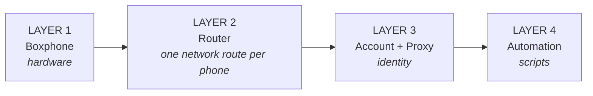

Read this page first. When something goes wrong, the first thing to do is not to fix it, but to **work out which layer is broken**. Once you know the layer, the problem is already half solved.

#### LAYER 1 · Boxphone

This is the hardware you bought from GenFarmer.

#### LAYER 2 · Router

GenRouter gives each phone its own internet route, nothing shared. GenRouter H3000 serves 1 box; for 2 or more boxes, use a mini PC.

#### LAYER 3 · Account + Proxy

This is what you need to prepare before launching your phone farm.

#### LAYER 4 · Automation

Ready-made scripts for logging in, warming up accounts and boosting engagement, bundled by GenFarmer into packages. If you have not bought one yet, contact GenFarmer sales on WhatsApp [+84 97 123 46 01](https://wa.me/84971234601) or in the [customer community](https://chat.whatsapp.com/J8bchy0IIwREeAI1z7Jmvo?mode=gi_t). If you do not want automation, you can do everything by hand.

:::caution
The five days of the roadmap follow these four layers in order: **devices first, then network and identity, scripts last.** Do not skip ahead, because each layer is built on the one before it.
:::

## Which layer — which day

| Layer | Name            | Learned on                                                                                             | Typical problems                                                      |
| ----- | --------------- | ------------------------------------------------------------------------------------------------------ | --------------------------------------------------------------------- |
| 1     | Boxphone        | [Day 1](/en/a2-lo-trinh-mot-tuan/a4-ngay-1-phan-cung)                                                      | Scan finds no phones, black screen                                    |
| 2     | Router          | [Day 2](/en/a2-lo-trinh-mot-tuan/a5-ngay-2-danh-tinh)                                                      | Phones show up but cannot get online, accounts get banned in clusters |
| 3     | Account + Proxy | [Day 2](/en/a2-lo-trinh-mot-tuan/a5-ngay-2-danh-tinh)                                                      | Asked for verification, nobody sees your posts                        |
| 4     | Automation      | [Day 3](/en/a2-lo-trinh-mot-tuan/a6-ngay-3-tu-dong) · [Day 4–5](/en/a2-lo-trinh-mot-tuan/a7-ngay-4-5-nen-tang) | Scripts run but the numbers do not move, wrong app installed          |

When you need a quick lookup based on what you are seeing on screen, use [Troubleshoot by symptom](/en/tra-cuu-theo-trieu-chung).
