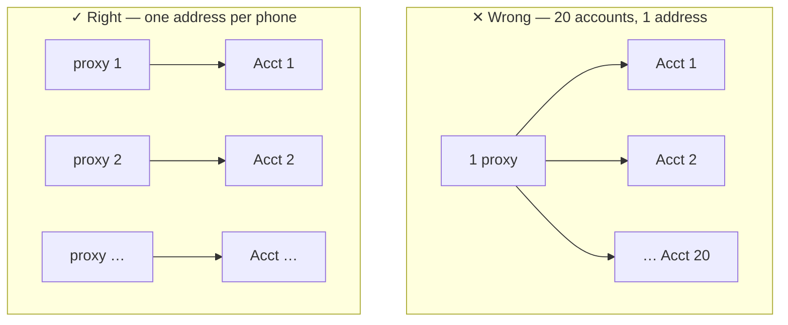

**Layer 2 · Router** + **Layer 3 · Account + Proxy**

:::caution
The most important day of the week — and the part the User Manual (HDSD) does not cover in depth. **Read this page carefully.**
:::

> **Question of the day:** Will my accounts survive?
>
> Start small, start slow. Today you only touch 5 accounts, and most of the time is spent waiting.

## Why accounts get banned in clusters

**An account is an identity. A proxy is that identity's home address.**

If 20 accounts share one address, the platform sees 20 people living in the same house, waking and sleeping at the same time, liking the same kind of content. That is why accounts get banned in clusters rather than one by one.

GenRouter exists so that **each phone has its own address**. **Isolate Mode** does one more thing: if a proxy dies, it cuts that phone's network immediately instead of letting the phone expose your real address.

**Prepare accounts + proxies → Assign proxies + Isolate Mode → Install the platform app → Log in by hand as a test → Import the account sheet → Run a simple job so the accounts get warmed up**

## Steps

### Prepare 5 accounts and 5 proxies

If you want to save money for the trial, 5 accounts spread over 2–3 proxies is acceptable, but remember that **this is not a real production setup**.

### Assign a proxy to each phone and turn on Isolate Mode

<figure><figcaption>The GenRouter panel at 192.168.5.1:9000: give each phone its own proxy, then turn on Isolate Mode.</figcaption></figure>

Open the GenRouter control panel at `192.168.5.1:9000`, assign a proxy to each phone, and turn on **Isolate Mode**.

:::note
Watch the [video guide on assigning proxies and turning on Isolate Mode](https://youtu.be/kGjP-7iqSTI). If it still does not work after following the video, [contact support](/en/lien-he-ho-tro) before you log in to any account.
:::

### Install the platform app on the phones

Download the APK file, select all phones, and click **Install APK**. _HDSD p. 17 · 51 · 78 · 102 · 124_

Install it on every phone today: Day 2 is when you start logging accounts in gradually to let them settle, so installing in advance saves work on the following days.

:::danger
**Do not download the APK from the links in the HDSD.** The APK links for Facebook, Instagram, X and Spotify in the HDSD are currently wrong (they point to the TikTok file). Download the APKs from the official folder below.
:::

**Official APK folder (includes TikTok, Facebook, Instagram, X, Spotify):** [APK\_GENFARMER — Google Drive](https://drive.google.com/drive/folders/1VfiJFierTV6bsRt0rSMaZVQYwkdjamPp?usp=drive_link)

### Log in to 1–2 accounts by hand

Go slowly and watch every step.

:::danger
This is the most important step of the whole week: the automation later only repeats exactly what you have just done by hand. If an account is already asked for verification when you do it by hand, the automation will hit the same thing, just 20 times faster.
:::

### Create an account sheet in Account Manager

<figure><figcaption>Account Manager: one row per account, with the right device assigned to each row.</figcaption></figure>

Only do this once the 1–2 accounts from the previous step are stable. _HDSD p. 10–11_

### Enter all 5 accounts into the sheet

The default format is `UID|Password|2FA`; to change it, go to **Custom**. _HDSD p. 11–13_

### Assign a device to each account

Copy the **Device ID** from the main screen and paste it into the Device ID column. _HDSD p. 14–15_

### Leave everything alone for 48 hours

Do not run anything. This is not dead time — **this is the test.**

## Done when

:::tip
**5 out of 5 accounts** can still log in after 48 hours, and none of them has been asked for verification or temporarily locked.
:::

:::danger
If you are not there yet, **do not buy more accounts under any circumstances**. Change your account supplier or change proxies, then retry from step 4 (log in by hand). Buying 20 accounts while 5 are still not surviving is the fastest way to waste money.
:::

## Three common mistakes

| ✕ | Mistake                                                                         | Consequence                                                                        |
| - | ------------------------------------------------------------------------------- | ---------------------------------------------------------------------------------- |
| 1 | Buying 20 accounts right away to fill the whole set                             | You lose all 20 in a single night                                                  |
| 2 | Sharing one proxy across many accounts to save money                            | Accounts get banned in clusters, and you wrongly conclude the hardware is at fault |
| 3 | Logging in to many accounts on the same phone one after another in a short time | No real person does that                                                           |

Next: [A6 · Day 3 — Basic automation](/en/a2-lo-trinh-mot-tuan/a6-ngay-3-tu-dong)
