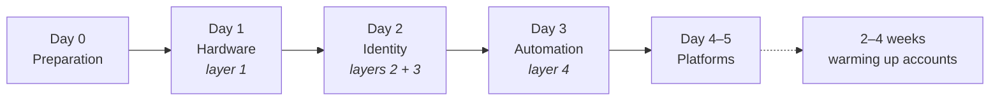

Each day answers exactly **one** question. Once you have answered it, move on to the next day; if not, stay where you are — there is no prize for going fast.

| Day         | Question                            | Done when                                    | Page                                            |
| ----------- | ----------------------------------- | -------------------------------------------- | ----------------------------------------------- |
| **Day 0**   | What do I need to have ready?       | You never get stuck halfway for lack of gear | [A3](/en/a2-lo-trinh-mot-tuan/a3-ngay-0-chuan-bi)   |
| **Day 1**   | Do the phones obey me?              | You can control 20 phones                    | [A4](/en/a2-lo-trinh-mot-tuan/a4-ngay-1-phan-cung)  |
| **Day 2**   | Will my accounts survive?           | Accounts do not get banned on the first day  | [A5](/en/a2-lo-trinh-mot-tuan/a5-ngay-2-danh-tinh)  |
| **Day 3**   | Can the machine do the work for me? | You go to sleep and the system keeps running | [A6](/en/a2-lo-trinh-mot-tuan/a6-ngay-3-tu-dong)    |
| **Day 4–5** | What can it produce for me?         | You configure it yourself, without asking    | [A7](/en/a2-lo-trinh-mot-tuan/a7-ngay-4-5-nen-tang) |

:::note
Every day page has the same three fixed sections: **Steps** → **Done when** → **Three common mistakes**. If you have not met the _Done when_ criterion, stop on that day; do not move on to the next.
:::
