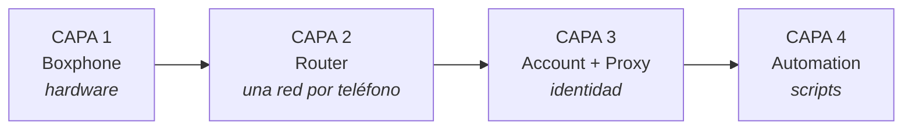

Lee esta página primero. Ante un problema, lo primero que debes hacer no es reparar, sino **identificar en qué capa está la falla**. Saber la capa ya es la mitad de la solución.

#### CAPA 1 · Boxphone

Es el hardware que compraste a GenFarmer.

#### CAPA 2 · Router

GenRouter da a cada teléfono una salida a internet propia, no compartida. GenRouter H3000 sirve para 1 box; a partir de 2 boxes se usa un mini PC.

#### CAPA 3 · Account + Proxy

Es lo que debes preparar para poner en marcha tu granja de teléfonos.

#### CAPA 4 · Automation

Scripts automatizados para iniciar sesión, calentar cuentas e impulsar interacciones que GenFarmer ya tiene listos en sus paquetes. Si aún no los compraste, contacta a ventas de GenFarmer por WhatsApp [+84 97 123 46 01](https://wa.me/84971234601) o en la [comunidad de clientes](https://chat.whatsapp.com/J8bchy0IIwREeAI1z7Jmvo?mode=gi_t). Si no quieres automatizar, puedes hacerlo de forma manual.

:::caution
Los cinco días de la hoja de ruta siguen exactamente el orden de estas cuatro capas: **primero el equipo, después la red y la identidad, y los scripts al final.** No te saltes ninguna, porque cada capa se construye sobre la anterior.
:::

## Qué capa — qué día

| Capa | Nombre          | Se aprende en                                                                                          | Problema típico                                                         |
| ---- | --------------- | ------------------------------------------------------------------------------------------------------ | ----------------------------------------------------------------------- |
| 1    | Boxphone        | [Día 1](/es/a2-lo-trinh-mot-tuan/a4-ngay-1-phan-cung)                                                      | Al pulsar Scan no aparece ningún teléfono, pantalla negra               |
| 2    | Router          | [Día 2](/es/a2-lo-trinh-mot-tuan/a5-ngay-2-danh-tinh)                                                      | El teléfono aparece pero no tiene red, las cuentas se bloquean en grupo |
| 3    | Account + Proxy | [Día 2](/es/a2-lo-trinh-mot-tuan/a5-ngay-2-danh-tinh)                                                      | Piden verificación, nadie ve las publicaciones                          |
| 4    | Automation      | [Día 3](/es/a2-lo-trinh-mot-tuan/a6-ngay-3-tu-dong) · [Día 4–5](/es/a2-lo-trinh-mot-tuan/a7-ngay-4-5-nen-tang) | Todo funciona pero las cifras no suben, se instala la app equivocada    |

Cuando necesites una consulta rápida según lo que ves en pantalla, usa [Diagnóstico por síntoma](/es/tra-cuu-theo-trieu-chung).
