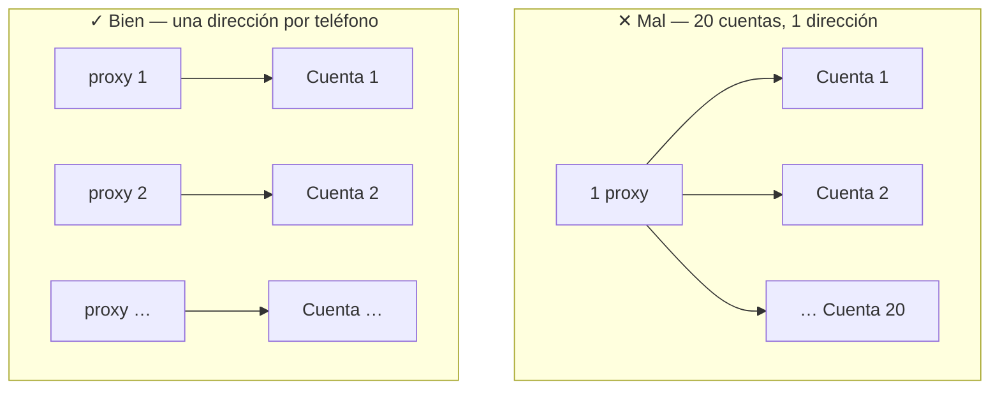

**Capa 2 · Router** + **Capa 3 · Account + Proxy**

:::caution
El día más importante de la semana — y la parte que el Manual de usuario (HDSD) no explica en detalle. **Lee esta página con atención.**
:::

> **Pregunta del día:** ¿Mis cuentas sobreviven?
>
> Empieza en pequeño y despacio. Hoy solo tocas 5 cuentas, y la mayor parte del tiempo es esperar.

## Por qué las cuentas se bloquean en grupo

**La cuenta es una identidad. El proxy es la dirección de casa de esa identidad.**

Si 20 cuentas usan la misma dirección, la plataforma verá a 20 personas viviendo en la misma casa, que se despiertan y se acuestan a la vez y a las que les gusta el mismo tipo de contenido. Por eso las cuentas se bloquean en grupo y no de una en una.

GenRouter existe para que **cada teléfono tenga su propia dirección**. El **Isolate Mode** hace algo más: si el proxy se cae, corta de inmediato la red de ese teléfono en lugar de dejar que exponga la dirección real.

**Preparar cuentas + proxies → Asignar proxy + Isolate Mode → Instalar la app de la plataforma → Probar el inicio de sesión a mano → Cargar la tabla de cuentas → Ejecutar algo sencillo para que las cuentas se calienten**

## Pasos

### Prepara 5 cuentas y 5 proxies

Si quieres ahorrar para probar, puedes repartir 5 cuentas entre 2–3 proxies, pero recuerda que **esa no es la configuración para producción**.

### Asigna un proxy a cada teléfono y activa el Isolate Mode

Entra al panel de control de GenRouter en `192.168.5.1:9000`, asigna un proxy a cada teléfono y activa el **Isolate Mode**.

:::note
Mira el [video sobre cómo asignar proxies y activar el Isolate Mode](https://youtu.be/kGjP-7iqSTI). Si siguiendo el video aún no funciona, [contacta a soporte](/es/lien-he-ho-tro) antes de iniciar sesión con las cuentas.
:::

### Instala la app de la plataforma en los teléfonos

Descarga el archivo APK, selecciona todos los teléfonos y pulsa **Install APK**. _HDSD pág. 17 · 51 · 78 · 102 · 124_

Instálala hoy mismo en todos los teléfonos: desde el Día 2 ya empiezas a iniciar sesión con las cuentas poco a poco para dejarlas reposar, así que tenerla instalada te ahorra trabajo en los días siguientes.

:::danger
**No descargues el APK desde los enlaces del HDSD.** Los enlaces de APK de Facebook, Instagram, X y Spotify en el HDSD están mal (apuntan al archivo de TikTok). Descarga los APK desde la carpeta oficial de abajo.
:::

**Carpeta oficial de APK (incluye TikTok, Facebook, Instagram, X y Spotify):** [APK\_GENFARMER — Google Drive](https://drive.google.com/drive/folders/1VfiJFierTV6bsRt0rSMaZVQYwkdjamPp?usp=drive_link)

### Inicia sesión a mano con 1–2 cuentas

Hazlo despacio y observa cada paso.

:::danger
Este es el paso más importante de toda la semana: la automatización solo repetirá exactamente lo que acabas de hacer a mano. Si al hacerlo a mano la cuenta ya pide verificación, la automatización hará lo mismo, solo que 20 veces más rápido.
:::

### Crea la tabla de cuentas en Account Manager

Hazlo solo cuando las 1–2 cuentas del paso anterior estén estables. _HDSD pág. 10–11_

### Carga las 5 cuentas en la tabla

El formato por defecto es `UID|Password|2FA`; si quieres cambiarlo, ve a la sección **Custom**. _HDSD pág. 11–13_

### Asigna un dispositivo a cada cuenta

Copia el **Device ID** de la pantalla principal y pégalo en la columna Device ID. _HDSD pág. 14–15_

### Déjalo reposar 48 horas

No ejecutes nada. No es tiempo perdido — **es la prueba.**

## Listo cuando

:::tip
**5 de 5 cuentas** siguen pudiendo iniciar sesión después de 48 horas, y ninguna pide verificación ni está bloqueada temporalmente.
:::

:::danger
Si no lo cumples, **no compres más cuentas bajo ningún concepto**. Cambia de proveedor de cuentas o de proxy y vuelve a intentarlo desde el paso 4 (iniciar sesión a mano). Comprar 20 cuentas cuando 5 todavía no sobreviven es la forma más rápida de perder dinero.
:::

## Tres errores frecuentes

| ✕ | Error                                                                          | Consecuencia                                                                               |
| - | ------------------------------------------------------------------------------ | ------------------------------------------------------------------------------------------ |
| 1 | Comprar 20 cuentas desde el principio para tener el lote completo              | Pierdes las 20 en una noche                                                                |
| 2 | Usar el mismo proxy para varias cuentas para ahorrar                           | Las cuentas se bloquean en grupo y acabas concluyendo, erróneamente, que el hardware falla |
| 3 | Iniciar sesión con muchas cuentas seguidas en el mismo teléfono en poco tiempo | Ninguna persona real hace eso                                                              |

Siguiente: [A6 · Día 3 — Primera automatización](/es/a2-lo-trinh-mot-tuan/a6-ngay-3-tu-dong)
