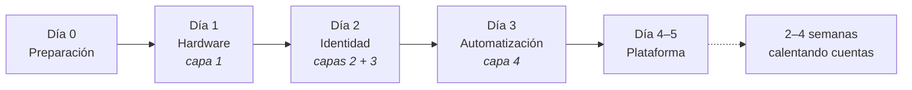

Cada día responde exactamente **una** pregunta. Cuando la respondas, pasa al día siguiente; si no, quédate — no hay premio por ir rápido.

| Día         | Pregunta                          | Listo cuando                                   | Página                                          |
| ----------- | --------------------------------- | ---------------------------------------------- | ----------------------------------------------- |
| **Día 0**   | ¿Qué necesito tener preparado?    | No te quedas a medias por falta de algo        | [A3](/es/a2-lo-trinh-mot-tuan/a3-ngay-0-chuan-bi)   |
| **Día 1**   | ¿El equipo me obedece?            | Controlo 20 teléfonos                          | [A4](/es/a2-lo-trinh-mot-tuan/a4-ngay-1-phan-cung)  |
| **Día 2**   | ¿Mis cuentas sobreviven?          | Las cuentas no se bloquean el primer día       | [A5](/es/a2-lo-trinh-mot-tuan/a5-ngay-2-danh-tinh)  |
| **Día 3**   | ¿El equipo puede trabajar por mí? | Me voy a dormir y el sistema sigue funcionando | [A6](/es/a2-lo-trinh-mot-tuan/a6-ngay-3-tu-dong)    |
| **Día 4–5** | ¿Qué resultados me da?            | Configuro por mi cuenta, sin preguntar a nadie | [A7](/es/a2-lo-trinh-mot-tuan/a7-ngay-4-5-nen-tang) |

:::note
Cada página de día tiene tres secciones fijas: **Pasos** → **Listo cuando** → **Tres errores frecuentes**. Si no cumples el criterio _Listo cuando_, detente en ese día; no pases al siguiente.
:::
