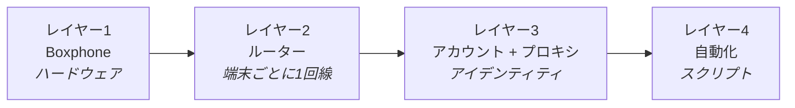

最初にこのページを読んでください。トラブルが起きたとき、まず行うべきことは修理ではなく、**どのレイヤーが壊れているかを特定すること**です。レイヤーが分かれば、問題は半分解決したも同然です。

#### レイヤー1 · Boxphone

GenFarmer から購入したハードウェアです。

#### レイヤー2 · ルーター

GenRouter は各端末に専用のインターネット回線を割り当て、共有させません。GenRouter H3000 は Box 1台用で、Box 2台以上の場合はミニPCを使います。

#### レイヤー3 · アカウント + プロキシ

スマホファームを稼働させるために、ご自身で準備が必要なものです。

#### レイヤー4 · 自動化

ログイン、アカウントの育成、エンゲージメントの拡散を自動化するスクリプトで、GenFarmer が自動化パッケージとして用意しています。未購入の場合は、WhatsApp [+84 97 123 46 01](https://wa.me/84971234601) または[ユーザーコミュニティ](https://chat.whatsapp.com/J8bchy0IIwREeAI1z7Jmvo?mode=gi_t)から GenFarmer のセールス担当にご連絡ください。自動化を使わず、手動で行うこともできます。

:::caution
ロードマップの5日間は、この4つのレイヤーの順番どおりに進みます。**まず端末、次にネットワークとアイデンティティ、最後にスクリプトです。** 後のレイヤーは常に前のレイヤーの上に成り立つため、飛ばしてはいけません。
:::

## どのレイヤーを、どの日に

| レイヤー | 名称           | 学ぶ日                                                                                                | 典型的なトラブル                                    |
| ---- | ------------ | -------------------------------------------------------------------------------------------------- | ------------------------------------------- |
| 1    | Boxphone     | [1日目](/ja/a2-lo-trinh-mot-tuan/a4-ngay-1-phan-cung)                                                    | Scan を押しても端末が見つからない、画面が真っ暗                  |
| 2    | ルーター         | [2日目](/ja/a2-lo-trinh-mot-tuan/a5-ngay-2-danh-tinh)                                                    | 端末は表示されるがネットワークにつながらない、アカウントがまとめて凍結（BAN）される |
| 3    | アカウント + プロキシ | [2日目](/ja/a2-lo-trinh-mot-tuan/a5-ngay-2-danh-tinh)                                                    | 本人確認を求められる、投稿が誰にも見られない                      |
| 4    | 自動化          | [3日目](/ja/a2-lo-trinh-mot-tuan/a6-ngay-3-tu-dong) · [4〜5日目](/ja/a2-lo-trinh-mot-tuan/a7-ngay-4-5-nen-tang) | 動いているのに数値が伸びない、違うアプリをインストールしてしまう            |

画面に表示されているものからすぐに調べたいときは、[症状から探す](/ja/tra-cuu-theo-trieu-chung)を使ってください。
