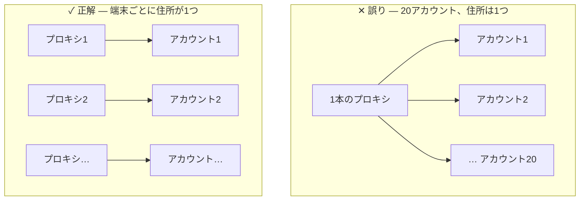

**レイヤー2 · ルーター** + **レイヤー3 · アカウント + プロキシ**

:::caution
この週で最も重要な日です — そして、ユーザーマニュアル（HDSD）ではまだ詳しく触れられていない部分です。**このページは、しっかり読んでください。**
:::

> **今日の問い：** 自分のアカウントは生き残れるか？
>
> まずは小さく、まずはゆっくりと。今日は5つのアカウントにしか触れず、時間の大半は待つことに使います。

## アカウントがまとめて凍結（BAN）される理由

**アカウントはアイデンティティであり、プロキシはそのアイデンティティの住所です。**

20個のアカウントが同じ住所を使えば、プラットフォームからは、20人が同じ家に住み、同じ時間に起きて寝て、同じ種類のコンテンツを好んでいるように見えます。アカウントが1つずつではなく、まとめて凍結（BAN）されるのはこのためです。

GenRouter は、**端末ごとに別々の住所を持たせる**ために存在します。**Isolate Mode** はさらにもう1つの働きをします。プロキシが落ちたとき、端末の本当の住所が露出するのを防ぐため、その端末のネットワークを即座に遮断します。

**アカウント + プロキシの準備 → プロキシの割り当て + Isolate Mode → プラットフォームのアプリをインストール → 手動でログインを試す → アカウント表に入力 → アカウントを育成するために簡単な動作を実行**

## 手順

### アカウント5個とプロキシ5本を準備する

お試しで費用を抑えたい場合は、5個のアカウントを2〜3本のプロキシに分けても構いません。ただし、**それは本番の構成ではない**ことを忘れないでください。

### 端末ごとにプロキシを割り当て、Isolate Mode をオンにする

<figure><figcaption>192.168.5.1:9000 の GenRouter パネル: 端末ごとに専用プロキシを割り当て、Isolate Mode をオンにします。</figcaption></figure>

GenRouter の管理画面 `192.168.5.1:9000` を開き、端末ごとにプロキシを割り当てて、**Isolate Mode** をオンにします。

:::note
[プロキシの割り当てと Isolate Mode の設定ビデオ](https://youtu.be/kGjP-7iqSTI)を参照してください。ビデオのとおりに行ってもうまくいかない場合は、アカウントにログインする前に[サポートに連絡](/ja/lien-he-ho-tro)してください。
:::

### 各端末にプラットフォームのアプリをインストールする

APK ファイルをダウンロードし、すべての端末を選択して **Install APK** を押します。_HDSD p.17 · 51 · 78 · 102 · 124_

今日のうちに全端末へインストールしておきます。2日目からアカウントを少しずつログインさせて寝かせ始めるので、先にインストールしておけば、後の日の作業が減ります。

:::danger
**HDSD に記載のリンクから APK をダウンロードしないでください。** HDSD にある Facebook、Instagram、X、Spotify の APK リンクは現在正しくありません（TikTok のファイルを指しています）。APK は下記の公式フォルダーからダウンロードしてください。
:::

**公式 APK フォルダー（TikTok、Facebook、Instagram、X、Spotify を収録）：** [APK\_GENFARMER — Google Drive](https://drive.google.com/drive/folders/1VfiJFierTV6bsRt0rSMaZVQYwkdjamPp?usp=drive_link)

### 1〜2個のアカウントに手動でログインする

ゆっくりと、1つひとつの手順を観察しながら行います。

:::danger
これは今週で最も重要な手順です。後の自動化は、いまあなたが手で行ったことをそのまま繰り返すだけです。手動でログインした時点でアカウントが本人確認を求められるなら、自動化でも同じことが起こり、しかも20倍の速さで起こります。
:::

### Account Manager でアカウント表を作成する

<figure><figcaption>Account Manager: 1行に1アカウント、各行に正しい端末を割り当てます。</figcaption></figure>

上の手順で1〜2個のアカウントが問題なかった場合のみ行います。_HDSD p.10–11_

### 5個のアカウントをすべて表に入力する

既定の形式は `UID|Password|2FA` です。変更したい場合は **Custom** から設定します。_HDSD p.11–13_

### アカウントごとに端末を割り当てる

メイン画面の **Device ID** をコピーし、Device ID 列に貼り付けます。_HDSD p.14–15_

### 48時間そのままにしておく

何も実行しません。これは無駄な時間ではなく、**テストです。**

## 完了の目安

:::tip
**5個中5個のアカウント**が48時間後もログインでき、本人確認や一時ロックを求められたアカウントが1つもない。
:::

:::danger
満たしていなければ、**絶対にアカウントを買い足さないでください**。アカウントの入手元またはプロキシを変えて、手順4（手動ログイン）からやり直します。5個のアカウントすら生き残っていないのに20個を買うのは、最も早くお金を失う方法です。
:::

## よくある3つの失敗

| ✕ | 失敗                          | 結果                                         |
| - | --------------------------- | ------------------------------------------ |
| 1 | 最初からセット分の20アカウントを購入する       | 一晩で20個すべてを失う                               |
| 2 | 節約のために複数のアカウントで1本のプロキシを共有する | アカウントがまとめて凍結（BAN）され、ハードウェアの問題だと誤って結論づけてしまう |
| 3 | 同じ端末で短時間に複数のアカウントへ続けてログインする | 本物の人間はそのような操作をしません                         |

次へ：[A6 · 3日目 — はじめての自動化](/ja/a2-lo-trinh-mot-tuan/a6-ngay-3-tu-dong)
