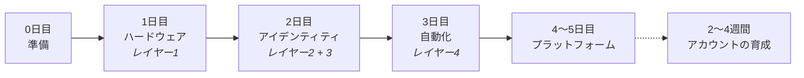

1日に答える問いは**1つ**だけです。答えられたら次の日へ進み、まだなら同じ日にとどまります。急いで進んでも、得るものは何もありません。

| 日         | 問い                 | 完了の目安                | ページ                                             |
| --------- | ------------------ | -------------------- | ----------------------------------------------- |
| **0日目**   | 何を準備しておけばよいか？      | 物が足りずに途中で止まらない       | [A3](/ja/a2-lo-trinh-mot-tuan/a3-ngay-0-chuan-bi)   |
| **1日目**   | 端末は自分の指示に従うか？      | 20台のスマートフォンを操作できる    | [A4](/ja/a2-lo-trinh-mot-tuan/a4-ngay-1-phan-cung)  |
| **2日目**   | 自分のアカウントは生き残れるか？   | 初日にアカウントが凍結（BAN）されない | [A5](/ja/a2-lo-trinh-mot-tuan/a5-ngay-2-danh-tinh)  |
| **3日目**   | 端末は自分の代わりに動いてくれるか？ | 自分が寝ている間もシステムが動き続ける  | [A6](/ja/a2-lo-trinh-mot-tuan/a6-ngay-3-tu-dong)    |
| **4〜5日目** | これで何が得られるのか？       | 誰にも聞かずに自分で設定できる      | [A7](/ja/a2-lo-trinh-mot-tuan/a7-ngay-4-5-nen-tang) |

:::note
各日のページは、**手順** → **完了の目安** → **よくある3つの失敗** という3つの固定パートで構成されています。_完了の目安_ を満たしていなければ、その日で止まり、次の日に進まないでください。
:::
