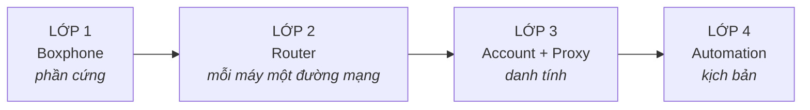

Đọc trang này trước tiên. Khi có sự cố, việc đầu tiên cần làm không phải là sửa, mà là **xác định hỏng ở lớp nào**. Biết được lớp là đã giải quyết xong một nửa.

#### LỚP 1 · Boxphone

Đây là phần cứng bạn đã mua từ GenFarmer.

#### LỚP 2 · Router

GenRouter cấp cho mỗi máy một đường ra internet riêng, không dùng chung. GenRouter H3000 dùng cho 1 box; từ 2 box trở lên dùng mini PC.

#### LỚP 3 · Account + Proxy

Đây là thứ bạn cần chuẩn bị để khởi chạy dàn farm của mình.

#### LỚP 4 · Automation

Các kịch bản tự động hoá đăng nhập, nuôi tài khoản, đẩy tương tác GenFarmer đã làm sẵn trong các gói package. Nếu bạn chưa mua, liên hệ sales GenFarmer qua WhatsApp [+84 97 123 46 01](https://wa.me/84971234601) hoặc [cộng đồng khách hàng](https://chat.whatsapp.com/J8bchy0IIwREeAI1z7Jmvo?mode=gi_t). Không muốn tự động thì có thể làm thủ công.

:::caution
Năm ngày trong lộ trình đi đúng thứ tự bốn lớp này: **máy trước, mạng và danh tính sau, kịch bản sau cùng.** Không được nhảy cóc, vì lớp sau luôn dựng trên lớp trước.
:::

## Lớp nào — ngày nào

| Lớp | Tên             | Học ở                                                                                                    | Sự cố điển hình                                                 |
| --- | --------------- | -------------------------------------------------------------------------------------------------------- | --------------------------------------------------------------- |
| 1   | Boxphone        | [Ngày 1](/vi/a2-lo-trinh-mot-tuan/a4-ngay-1-phan-cung)                                                       | Bấm Scan không ra máy, màn hình đen                             |
| 2   | Router          | [Ngày 2](/vi/a2-lo-trinh-mot-tuan/a5-ngay-2-danh-tinh)                                                       | Máy hiện lên nhưng không vào được mạng, tài khoản chết theo cụm |
| 3   | Account + Proxy | [Ngày 2](/vi/a2-lo-trinh-mot-tuan/a5-ngay-2-danh-tinh)                                                       | Bị hỏi xác minh, bài đăng không ai thấy                         |
| 4   | Automation      | [Ngày 3](/vi/a2-lo-trinh-mot-tuan/a6-ngay-3-tu-dong) · [Ngày 4–5](/vi/a2-lo-trinh-mot-tuan/a7-ngay-4-5-nen-tang) | Chạy mà số liệu không tăng, cài nhầm ứng dụng                   |

Khi cần tra nhanh theo thứ đang thấy trên màn hình, dùng [Tra cứu theo triệu chứng](/vi/tra-cuu-theo-trieu-chung).
