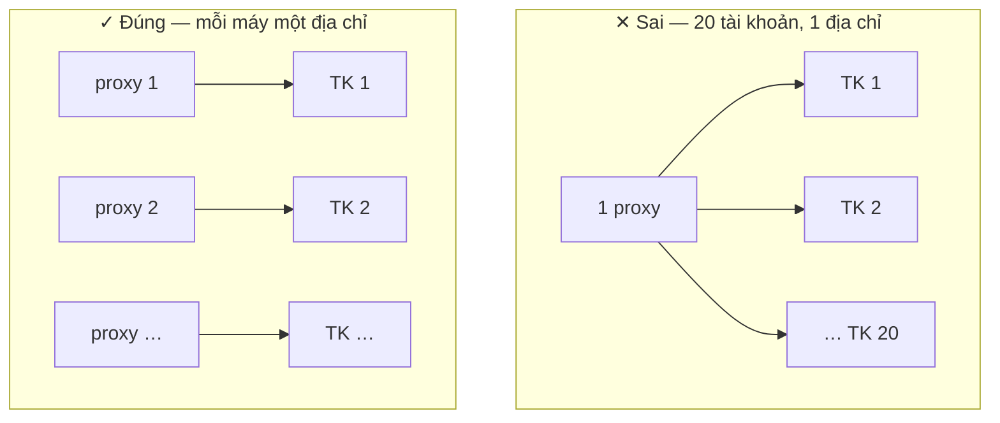

**Lớp 2 · Router** + **Lớp 3 · Account + Proxy**

:::caution
Ngày quan trọng nhất tuần — và là phần HDSD chưa nói kỹ. **Đọc kỹ trang này.**
:::

> **Câu hỏi của ngày:** Tài khoản của tôi có sống được không?
>
> Làm nhỏ trước, làm chậm trước. Hôm nay chỉ đụng tới 5 tài khoản, và phần lớn thời gian là ngồi chờ.

## Vì sao tài khoản chết theo cụm

**Tài khoản là danh tính. Proxy là địa chỉ nhà của danh tính đó.**

Nếu 20 tài khoản cùng dùng một địa chỉ, nền tảng sẽ thấy 20 người sống chung một nhà, cùng thức cùng ngủ, cùng thích một loại nội dung. Đó là lý do tài khoản chết theo cụm chứ không chết lẻ.

GenRouter tồn tại để **mỗi máy có một địa chỉ riêng**. Chế độ **Isolate Mode** thì làm thêm một việc: nếu proxy chết, nó cắt mạng máy đó ngay lập tức thay vì để máy lộ địa chỉ thật.

**Chuẩn bị account + proxy → Gán proxy + Isolate Mode → Cài app nền tảng → Đăng nhập thử bằng tay → Nhập bảng tài khoản → Chạy đơn giản để tài khoản được nuôi**

## Các bước

### Chuẩn bị 5 tài khoản và 5 proxy

Nếu muốn tiết kiệm để thử thì 5 tài khoản chia cho 2–3 proxy cũng được, nhưng nhớ rằng **đó không phải cấu hình chạy thật**.

### Gán proxy cho từng máy, bật Isolate Mode

Vào bảng điều khiển GenRouter tại `192.168.5.1:9000`, gán proxy cho từng máy, bật **Isolate Mode**.

:::note
Xem [video hướng dẫn gán proxy và bật Isolate Mode](https://youtu.be/kGjP-7iqSTI). Nếu làm theo video vẫn chưa được, [liên hệ hỗ trợ](/vi/lien-he-ho-tro) trước khi đăng nhập tài khoản.
:::

### Cài ứng dụng nền tảng lên các máy

Tải file APK, chọn tất cả máy, bấm **Install APK**. _HDSD tr. 17 · 51 · 78 · 102 · 124_

Cài đủ cho toàn bộ máy ngay từ hôm nay: Ngày 2 đã bắt đầu đăng nhập dần tài khoản để ngâm, nên cài sẵn sẽ tiết kiệm việc cho các ngày sau.

:::danger
**Đừng tải APK theo link trong HDSD.** Link APK của Facebook, Instagram, X và Spotify trong HDSD hiện chưa đúng (đang trỏ sang file TikTok). Tải APK từ thư mục chính thức bên dưới.
:::

**Thư mục APK chính thức (đủ TikTok, Facebook, Instagram, X, Spotify):** [APK\_GENFARMER — Google Drive](https://drive.google.com/drive/folders/1VfiJFierTV6bsRt0rSMaZVQYwkdjamPp?usp=drive_link)

### Đăng nhập bằng tay 1–2 tài khoản

Làm chậm, quan sát từng bước.

:::danger
Đây là bước quan trọng nhất cả tuần: tự động sau này chỉ lặp lại đúng những gì bạn vừa làm bằng tay. Nếu làm tay mà tài khoản đã bị hỏi xác minh, thì tự động cũng sẽ như vậy, chỉ nhanh hơn 20 lần.
:::

### Tạo bảng tài khoản trong Account Manager

Chỉ làm khi 1–2 tài khoản ở bước trên ổn. _HDSD tr. 10–11_

### Nhập đủ 5 tài khoản vào bảng

Định dạng mặc định là `UID|Password|2FA`, muốn đổi thì vào mục **Custom**. _HDSD tr. 11–13_

### Gán thiết bị cho từng tài khoản

Sao chép **Device ID** ở màn hình chính, dán vào cột Device ID. _HDSD tr. 14–15_

### Để yên 48 giờ

Không chạy gì cả. Đây không phải thời gian chết — **đây là phép thử.**

## Xong khi

:::tip
**5 trên 5 tài khoản** vẫn đăng nhập được sau 48 giờ, không tài khoản nào bị hỏi xác minh hay khoá tạm.
:::

:::danger
Chưa đạt thì **tuyệt đối chưa mua thêm tài khoản**. Đổi nguồn tài khoản hoặc đổi proxy rồi thử lại từ bước 4 (đăng nhập bằng tay). Mua 20 tài khoản khi 5 tài khoản còn chưa sống là cách tốn tiền nhanh nhất.
:::

## Ba lỗi hay gặp

| ✕ | Lỗi                                                                        | Hậu quả                                                           |
| - | -------------------------------------------------------------------------- | ----------------------------------------------------------------- |
| 1 | Mua 20 tài khoản ngay từ đầu cho đủ bộ                                     | Mất cả 20 trong một đêm                                           |
| 2 | Dùng chung một proxy cho nhiều tài khoản để tiết kiệm                      | Tài khoản chết theo cụm, rồi kết luận nhầm là phần cứng có vấn đề |
| 3 | Đăng nhập liên tiếp nhiều tài khoản trên cùng một máy trong thời gian ngắn | Không người thật nào làm vậy                                      |

Tiếp theo: [A6 · Ngày 3 — Tự động sơ khai](/vi/a2-lo-trinh-mot-tuan/a6-ngay-3-tu-dong)
