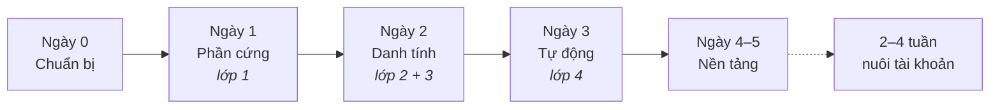

Mỗi ngày trả lời đúng **một** câu hỏi. Trả lời xong thì sang ngày tiếp theo, chưa xong thì ở lại — không có phần thưởng nào cho việc đi nhanh.

| Ngày         | Câu hỏi                               | Xong khi                                 | Trang                                           |
| ------------ | ------------------------------------- | ---------------------------------------- | ----------------------------------------------- |
| **Ngày 0**   | Tôi cần chuẩn bị sẵn những gì?        | Không bị kẹt giữa chừng vì thiếu đồ      | [A3](/vi/a2-lo-trinh-mot-tuan/a3-ngay-0-chuan-bi)   |
| **Ngày 1**   | Máy có nghe lời tôi không?            | Tôi điều khiển được 20 chiếc điện thoại  | [A4](/vi/a2-lo-trinh-mot-tuan/a4-ngay-1-phan-cung)  |
| **Ngày 2**   | Tài khoản của tôi có sống được không? | Tài khoản không chết ngay trong ngày đầu | [A5](/vi/a2-lo-trinh-mot-tuan/a5-ngay-2-danh-tinh)  |
| **Ngày 3**   | Máy có tự làm thay tôi được không?    | Tôi đi ngủ mà hệ thống vẫn chạy          | [A6](/vi/a2-lo-trinh-mot-tuan/a6-ngay-3-tu-dong)    |
| **Ngày 4–5** | Nó làm ra được gì cho tôi?            | Tôi tự cấu hình được, không cần hỏi ai   | [A7](/vi/a2-lo-trinh-mot-tuan/a7-ngay-4-5-nen-tang) |

:::note
Mỗi trang ngày có ba phần cố định: **Các bước** → **Xong khi** → **Ba lỗi hay gặp**. Chưa đạt tiêu chí _Xong khi_ thì dừng ở ngày đó, đừng sang ngày kế.
:::
